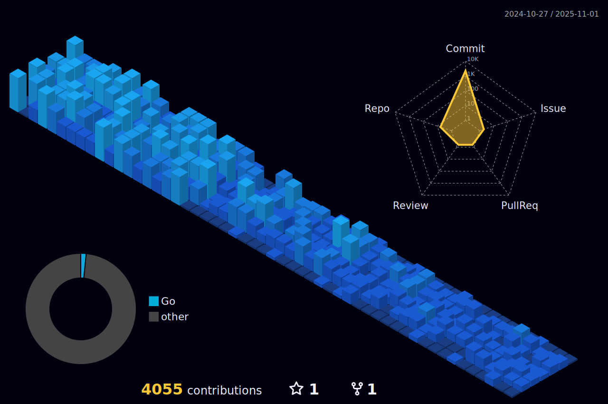
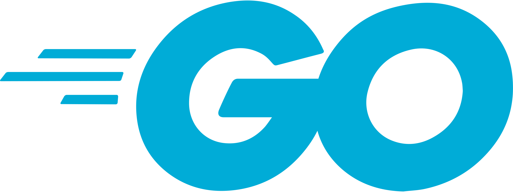

<table>
  <tr>
    <td colspan="4" rowspan="3" align="center">
    	 
    </td>
    <td align="center"></td>
    <td align="center"></td>
    <td align="center"></td>
    <td align="center"></td>
  </tr>
  <tr>
    <td align="center"></td>
    <td align="center"></td>
    <td align="center"></td>
    <td align="center"></td>
  </tr>
  <tr>
    <td align="center"></td>
    <td align="center"></td>
    <td align="center"></td>
    <td align="center"></td>
  </tr>
</table>

<b><i>Knowledge and Education should be open and free. Hierarchy and Exploitation must be abolished.</i></b>

